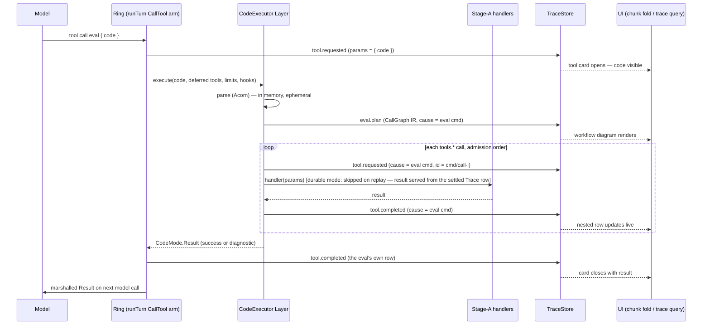

# Kernel-by-Layers, Codemode, and Skills — architecture report

Status: **revised v3** (2026-07-10), after owner review of v2. Two
changes in v3:

- **`effect/unstable/workflow` is out as the durable-codemode
  substrate.** The owner: *"This makes me concerned. I don't want to
  use Effect workflows, it brings with a ton of technical debt and
  coupling to their decisions which are typically anti-serverless. When
  did we decide to do that? I'd prefer to control that and not impose
  activities, instead use ctx.\* for a durable execution."* The honest
  answer to "when did we decide": never, as an owner decision — the
  library entered via the effect-ai mapping research and
  `alchemy-ai-design.md` §3.2's "evaluate backing `@effect/workflow`'s
  engine" note, and v2 of this report adopted it; that design-doc note
  is hereby superseded (§5.6 records it). §5.6 is rewritten: durable
  codemode is owned by the **kernel's own seams** — the Trace IS the
  memoization ledger (write-ahead `tool.requested` + settled
  `tool.completed/failed` rows with deterministic
  `(evalCommandId, admissionIndex)` ids; resume = deterministic
  re-execution with completed calls served from the rows), parks ride
  the existing Ask/park machinery on the harness's Durability seam
  (§2.7 doctrine: rows + stash points + alarms), and no Workflow /
  Activity / DurableDeferred primitive appears anywhere in the design.
  This is exactly Vercel's shipped `{code, determinism, ledger}`
  continuation (prior-art §3) hand-rolled on our substrate — the
  production validation survives the substrate change untouched.
  `@cloudflare/dynamic-workflows` interop is demoted to an *optional
  alternative executor Layer* for that platform, never the contract.
- **Terminology: Entity → runs as actors** *(updated again for the
  July 2026 resting point — canon:
  [../business-processes.md](../business-processes.md))*. The owner
  rejected the sibling's `AI.Entity` term; the interim "keyed,
  stateful Process" (`AI.key(param)` / `AI.state(schema, initial)`
  splices, per-key sharded rings, `ctx.state` staged commits) that v3
  briefly adopted was subsequently removed as well. The resting model:
  the run **is** the instance (identity = `(term, work item)`,
  addressed via `steer(runKey, …)`); everything is a message; state
  lives in your DB (outside, in your transaction) or as a userland
  fold over the Trace. "Entity" survives only as a documented pattern
  name. References updated where this report touched it.

Retained from **v2** (2026-07-10, after owner review of v1 and the
sibling source-level survey
[bp-codemode-prior-art.md](./bp-codemode-prior-art.md)):

- **`KernelPrompts.ts` is dissolved as a shared module** (§4). The owner:
  *"this kernelPrompts thing needs to go — it was premature abstraction.
  Just have every kernel implement things directly instead of sharing
  these around, otherwise we back ourselves into a corner."* v2 proposes
  the concrete dissolution: control-ref render blocks move to
  `Render.ts` (they were term-language assets miscategorized as kernel
  prose), synthetic-tool descriptions move into the new tool *terms*'
  own templates, and the behavioral connective tissue (nag, verifier
  framing, steers, acks, failure texts) inlines into `KernelMemory.ts`
  as that kernel's private prose. What the module was defending
  (byte-stable renders, dev/prod parity) is preserved per-kernel and —
  where it actually matters — by sharing *terms*, not wording (§4.4).
- **Kernel-provided tools are ordinary `AI.Tool` terms** (§3). The
  owner: *"I don't know what's going on with `AiTool.make("eval", …)` …
  I'd expect eval to be defined like `export class Eval extends
  AI.Tool<Eval, ...>()("Eval") {}`."* Correct — `AiTool.make` is
  effect/ai's *wire-level* constructor, the thing Stage A compiles user
  Tool terms INTO (`KernelMemory.ts:1783-1790`); v1 (following today's
  code at `KernelMemory.ts:1112-1127`) skipped the term column for
  synthetics and wrote the wire row directly. v2 defines `Eval`,
  `Resolve`, `GiveUp`, `ActivateSkill`, `DeactivateSkill`, `CheckRuns`,
  `WaitRun` as real terms in `src/AI/`, with kernel-provided
  implementations whose handlers close over ring state exactly the way
  `WriteFileR2` closes over its bucket. The survey confirms the shape:
  in every system the codemode tool is an ordinary registry tool
  (prior-art delta 13).
- **§5.4 "The life of an eval"** is new — the end-to-end walkthrough the
  owner asked for (*"Where is the AST used? Who is evaluating it? Who
  can access the data structures to display it? … can we query it?"*).
  Short version: every artifact a UI or query touches is a Trace row;
  the AST is a transient parse inside the `CodeExecutor` Layer, used in
  exactly two places, persisted never. The survey found no shipping
  system stores an AST (prior-art §"cross-cutting"); our one novel
  addition — a durable `eval.plan` row carrying the extracted call-graph
  IR — is explicitly a *cache* derived from the (durable) code string,
  never a second truth.
- **Skills activation is settled as a normative kernel contract** (§6.4)
  — specified once, conformance-tested, implemented by every conforming
  kernel, exactly like halt-as-tool today. Not an optional per-kernel
  extra; a kernel that hasn't implemented it yet has one sound degraded
  mode (expose everything eagerly).
- **Prior art integrated** (§5.1): eve's QuickJS + signed replay
  continuations are now *verified* (v1 could not) and confirm the
  durable design; Codex ships a literal `ToolMode { Direct, CodeMode,
  CodeModeOnly }` enum as per-model metadata; Cloudflare's Code Mode /
  Think / dynamic-workflows are disentangled; mastra and pi have
  nothing (pi deliberately). Design deltas vs v1 are called out inline
  and collected in §5.1.3.
- **Conventions aligned with the sibling reports**: implementation
  choice is a Layer-level decision (`AI.process` / `AI.codemode` /
  `AI.layer` all return Layers — bp-dx v2 §1.2, bp-ddd §4.1); every
  handler sketch uses the effectful-constructor pattern
  (`examples/cloudflare-agent/src/tools/Fs.ts:21-29`); the
  transactional boundary lives **outside the process** — your DB
  transaction, or the run itself (an actor whose emitted facts commit
  atomically with its Trace terminal) — per the July 2026 resting
  point, which superseded the sibling's keyed-Process redesign.

Line citations re-verified against the current tree (`KernelMemory.ts`
is 1879 lines; v1's citations held).

## 0. The verdict up front

1. **One kernel, not N — and the seam now has a shipped precedent with
   our exact name.** Standard vs Codemode is a swap of one seam: how
   the compiled tool universe is presented to the model and how a
   model-emitted call is executed. OpenAI's Codex ships `enum ToolMode {
   Direct, CodeMode, CodeModeOnly }` as *per-model server metadata*
   (prior-art §2b) — the seam is real, and it is finer than v1 drew it:
   membership is **per-tool** (direct vs deferred-into-the-sandbox),
   and the third mode (`CodeModeOnly`, deferred tools hidden from the
   direct surface) must be expressible. The `Kernel` interface never
   learns the word "codemode" — doctrine holds (`Kernel.ts:55-60`).
2. **Every tool the model can call is an `AI.Tool` term** — user
   capability terms AND kernel protocol terms (`Eval`, `Resolve`,
   `GiveUp`, `ActivateSkill`, `DeactivateSkill`, `CheckRuns`,
   `WaitRun`). The kernel stops minting anonymous `AiTool.make`
   literals with prose pulled from a shared module; it *implements* the
   shared terms, its handlers closing over ring state via the same
   effectful-constructor shape as any tool Layer. One compile path
   (Stage A) serves both; the term is the single source of name, prose,
   and schema. Kernel terms are excluded from `Req` (the kernel
   provides them; a deployment never does), but a user may interpolate
   `${Resolve}` in prose to *reference* one (§3.5).
3. **Codemode = the `Eval` term over the same compiled handlers.**
   Stage A (`compileTools`, `KernelMemory.ts:1612-1862`) already
   produces `name → (params) => Effect` handlers plus rendered
   descriptions and Parameter schemas — exactly what a confined code
   runtime needs. The vendored `.vendor/opencode/packages/codemode`
   interpreter remains the reference executor (now also *shipped* in
   opencode behind a flag, with a written doctrine we should copy —
   prior-art §1); model-facing dialect stays confined promise-JS, not
   `Effect.gen` (unchanged from v1; re-confirmed by every surveyed
   system).
4. **Durable codemode = deterministic re-execution + a memoized tool
   boundary, owned by the kernel's own seams — no workflow engine.**
   The memoization ledger IS the Trace: every inner `tools.*` call is
   already written ahead as `tool.requested` and settled as
   `tool.completed/failed` with a deterministic id keyed by
   `(evalCommandId, admissionIndex)`; on resume the program re-executes
   from source and completed calls are **served from those rows**
   instead of re-executing. This is Vercel's shipped
   `{ code, determinism, ledger }` continuation (prior-art §3),
   hand-rolled on our substrate — the production validation, without
   importing `effect/unstable/workflow` (owner decision, v3; the
   library's Activities were v2's substrate and are removed — §5.6).
   Parks ride the existing Ask machinery on the harness's Durability
   seam. Two adopted refinements from eve survive unchanged (they are
   substrate-independent): a **`replayed: boolean`** flag on
   codemode-emitted Trace rows (UIs skip replays), and transcript
   hygiene (one eval call → one result, however many park/resume
   cycles happened). OpenClaw's VM snapshots remain the
   considered-and-rejected alternative (version-fragile, TTL-bound,
   opaque).
5. **The AST is nobody's API.** It is parsed inside the `CodeExecutor`
   Layer, used twice (execution; plan extraction), persisted never.
   What is durable and queryable is (a) the code string — already in
   the eval's `tool.requested` row, already rendered by the UI's chunk
   fold (`src/AI/Api/Chunks.ts:135-149`), already queryable via
   `kernel.trace(ring, after)` — and (b) the inner calls' rows stamped
   with `cause` = the eval's command id, plus (c) one recommended
   `eval.plan` row carrying the call-graph IR so any UI renders the
   workflow diagram without shipping a parser. The full walkthrough
   with a who-produces-what table is §5.4.
6. **`KernelPrompts.ts` dies.** Its five control-ref render blocks were
   never kernel prose — they are part of the deterministic term render
   (same term ⇒ same string ⇒ same `promptHash`, `Render.ts:5-7`) and
   move into `Render.ts`. Its synthetic-tool descriptions become the
   protocol terms' templates. The rest (nag, verifier, steers, acks,
   failure texts) is the memory kernel's own voice and inlines there.
   Cross-kernel consistency is enforced where it is load-bearing — the
   shared *terms* fix the model-visible names/schemas/core prose; the
   conformance suite asserts *behavioral* contracts, never bytes
   (§4.4).
7. **Skills**: the `Skill` term is universal pure data; the activation
   *protocol* (the `ActivateSkill`/`DeactivateSkill` terms,
   `skill.activated/deactivated` rows, exposure semantics over the
   `Req` upper bound) is a normative kernel contract, conformance-
   tested like halt-as-tool. Recommendation and argument in §6.4.

---

## 1. Anatomy of `KernelMemory.ts` — the seam lines that already exist

Read in full (1879 lines). The file is one `Layer.effect(Kernel, …)`
(`KernelMemory.ts:150-1505`) with these load-bearing regions:

| Region | Lines | What it does | Seam status |
|---|---|---|---|
| Seam resolution | 155-184 | `TraceStore`, `AskHub`, `EventBus` via `Effect.serviceOption` + in-memory defaults | **already seams** |
| `KernelPolicy` | 86-97 | `Context.Reference` — per-turn ceilings | already a seam (reference w/ default) |
| Charter render | 225-244 | `renderCharter` — resolves `AI.value` refs once per interpretation | fixed (doctrine: per-interpretation, cache-stable) |
| Machine-exit subscribe | 196-272 | `AI.until(source, match)` → the one kernel-internal `EventBus` subscription (input auto-delivery is gone; the front door delivers) | seam via `EventBus` |
| **Stage A — compile** | 1612-1862 | `compileTools`: Tool tags → handlers + `AiTool.make` schemas; Agent/Process refs → delegation tools (handler = child `dispatch`, 1653-1758); `check_runs`/`wait_run` synthetics (1796-1846); toolkit assembled with **stub handlers** because `disableToolCallResolution` means effect/ai never executes (1848-1861) | **the cut point for `ToolMode`**; §3 replaces the synthetic `AiTool.make` literals with terms |
| Halt-as-tool | 1112-1174 | synthetic `resolve`/`give_up` (`AiTool.make` at 1113/1123), kernel-owned handlers writing `currentRun` (1103-1104) | becomes the `Resolve`/`GiveUp` terms (§3.2); stays strategy-independent (§5.7) |
| **Stage B — turn driver** | 355-691 | `runTurn`: pure `Step.step` transitions; `CallModel` → `model.streamText({ toolkit, disableToolCallResolution: true })` (448-456) with stall guard (464-473) and bounded retry (555-566); `CallTool` → write-ahead row (589-593), handler lookup (594), Ask provision scoped to the command (600-625), race vs interrupt signal (631-643), model-visible failure text (644-650) | **`CallTool` arm = the execute cut; `CallModel`'s `compiled.toolkit` = the presentation cut** |
| **Stage C — ring** | 283-874 | mailbox (700-777), steer park (325-333, 850-858), interrupt cascade (779-871), admission rows (717-731, 750-761) | strategy-independent |
| Agent interpretation | 878-912 | one turn per item | unchanged |
| Process interpretation | 916-1399 | never / machine-observed / model-declared exits; check via judge or `MachineCheck` (1060-1093, 1259-1332); §2.5 boundary: ceilings, fold, nag (1350-1393) | unchanged |
| Deterministic handler | 1405-1485 | `AI.process` path — no toolkit at all (1418) | unaffected by everything here |

Two facts make the decomposition cheap:

- **The model never executes tools.** `disableToolCallResolution: true`
  (`KernelMemory.ts:455`) plus stub handlers (1851-1859) means the
  toolkit is *pure advertisement*; execution is entirely the kernel's
  `handlers` map. Presentation and execution are already separate data.
- **The `CompiledTools` boundary is already the right type, minus
  structure.** Today it is `{ toolkit: unknown, handlers: Map }`
  (`KernelMemory.ts:1521-1529`) — the toolkit is pre-baked. Lift the
  intermediate representation (term, description, schema, kind,
  handler) out and both presentation strategies become consumers of it.

---

## 2. Kernel decomposition — one kernel assembled from component Layers

### 2.1 Why not separate kernels

The Kernel interface's whole design bet is that "memory", "sandbox",
"compaction" are *private seams of implementations* (`Kernel.ts:55-60`).
A `KernelCodemode` sibling would (a) fork the ring/turn machinery and
the purchased rules encoded in it (`Step.ts:21-35` — truncated-batch,
steering-at-boundary, pairing repair), (b) put a *tool-presentation*
word into user-facing vocabulary at the wrong layer (users pick kernels
per *harness* — memory vs Cloudflare — not per prompt strategy), and (c)
block the actually-desirable composition: codemode on the **Cloudflare**
kernel. Tool mode is orthogonal to harness; only Layers compose
orthogonally.

The survey strengthens this from argument to precedent: Codex holds one
agent core and varies tool mode as *data on the model description*
(`tool_mode: Option<ToolMode>`, prior-art §2b); opencode's v2 plan holds
one registry where tools are *direct* or *deferred* and the single
`execute` tool materializes only when visible deferred tools exist
(prior-art §1d); Vercel ships codemode as a separate package over the
unchanged `ai` interface (prior-art §7). Nobody forked their agent loop.

### 2.2 The component map

Resolution point matters: **per-kernel** seams are resolved once when
the kernel Layer is built (as `TraceStore` is today,
`KernelMemory.ts:155-162`); **per-interpretation** seams are resolved
inside `interpret()` from the ambient context of the *term's* Layer —
which is what makes per-agent overrides work by ordinary
`Layer.provide` on `AI.layer(term)`, exactly like per-agent tool
physics (`Kernel.ts:163-171`).

| Component | Tag | Resolved | Default | Today |
|---|---|---|---|---|
| Model | `LanguageModel` (effect/ai) | per-kernel | required | required input of `memory` (`KernelMemory.ts:150-154`) |
| Trace persistence | `TraceStore` | per-kernel | in-memory | seam, landed (`TraceStore.ts:52-55`) |
| Event delivery | `EventBus` | per-kernel | in-memory | seam, landed |
| Ask hub | `AskHub` | per-kernel | in-memory | seam, landed (`Ask.ts:93-95`) |
| Ceilings | `KernelPolicy` | per-interpretation | `{ maxModelCalls: 24 }` | `Context.Reference`, landed (`KernelMemory.ts:86-97`) |
| **Tool mode** | `ToolMode` | **per-interpretation** | Standard | new — extracted from `compileTools` + `CallTool` arm |
| **Code executor** | `CodeExecutor` | per-interpretation | — (required by codemode only) | new |
| Context policy | `ContextPolicy` | per-interpretation | truncate | designed, not landed |
| Durability | `Durability` | per-kernel | none (memory) | Phase 3 — the harness's own persistence/wake substrate (DO storage + alarms); `CodeExecutor.durable` rides it and `TraceStore`, never a workflow engine (§5.6) |
| Sandbox | `Sandbox` | per-term physics | — | Phase 3; this is *tool implementation* physics (where `Bash` runs), NOT where codemode's generated JS runs — `CodeExecutor` owns that |
| ~~Prompt assets~~ | ~~`kernelPrompts`~~ | — | — | **dissolved** (§4): term-language renders → `Render.ts`; tool prose → the terms; the rest → per-kernel private prose |

The Kernel *interface* mentions none of these — the doctrine sentence
to preserve verbatim is `Kernel.ts:57-60`: seams "exist only as
services that particular Kernel *implementations* pull from their own
requirements (seams), invisible to this interface." `ToolMode` and
`CodeExecutor` join that list; they are exported from `AI.*` for Layer
composition but absent from `KernelService`.

### 2.3 The `ToolMode` seam contract

Two changes from v1, both from the survey. First, `CompiledTool` now
carries the **term** (so a presentation can re-render or scope prose
without reaching back into the kernel), and membership is **per-tool**:
each compiled tool is `direct` (advertised as a wire tool even under
codemode) or `deferred` (enters the sandbox tree, hidden from the
direct surface) — opencode's v2 vocabulary, Codex's
`is_excluded_from_code_mode`, and eve's hand-picked subagents-only tree
are all expressible as assignments of this bit (prior-art deltas 1-2).
Second, the mode set is three-valued in spirit: `standard` (all
direct), `codemode` (deferred tools in the sandbox, direct tools — halt
tools, skill controls, anything marked direct — still wire tools), and
"codemode-only" is just codemode with nothing marked direct.

```ts
// AI/ToolMode.ts
export interface CompiledTool {
  /** The AI.Tool term (user capability or kernel protocol term). For
      delegation tools — minted per interpolated Agent/Process — this is
      the process term. */
  readonly term: unknown;
  readonly name: string;
  /** rendered template (all tools now have one — §3) */
  readonly description: string;
  /** S.Struct from Parameter refs; delegation = { task, background } */
  readonly parameters: S.Top;
  /** provenance — strategies may present kinds differently */
  readonly kind: "capability" | "delegation" | "halt" | "background" | "skill-control" | "eval";
  /** direct = always a wire tool; deferred = enters the codemode tree */
  readonly placement: "direct" | "deferred";
  /** the kernel-owned executor (Stage-A closure; the model never runs it) */
  readonly handler: (params: unknown) => Effect.Effect<unknown, unknown>;
}

/** What the turn driver consumes per model call. */
export interface ToolPresentation {
  /** advertised toolkit for THIS call, given the exposed subset */
  readonly toolkit: (exposed: ReadonlySet<string>) => Toolkit.WithHandler<any>;
  /** system-prompt tail owned by the strategy (codemode instructions/catalog); "" for standard */
  readonly instructions: (exposed: ReadonlySet<string>) => string;
  /** execute one model-emitted call; inner activity rides `ctx` */
  readonly execute: (
    call: { readonly callId: string; readonly name: string; readonly params: unknown },
    ctx: ToolRunContext,
  ) => Effect.Effect<unknown, unknown>;
}

/** Per-run context threaded from the ring (all already exist in runTurn). */
export interface ToolRunContext {
  readonly session: string;
  /** write-ahead rows for inner calls — same TraceStore path as today */
  readonly emit: (type: string, cause: string, kind: string, payload?: unknown) => Effect.Effect<unknown>;
}

export class ToolMode extends Context.Service<
  ToolMode,
  (tools: ReadonlyArray<CompiledTool>) => Effect.Effect<ToolPresentation>
>()("alchemy/AI/ToolMode") {}

export const standard: Layer.Layer<ToolMode> = /* today's behavior, extracted */;
export const codemode: Layer.Layer<ToolMode, never, CodeExecutor> = /* §5 */;
```

Notes on the shape (unchanged from v1 where not marked):

- **`toolkit`/`instructions` are functions of the exposed set**, not
  constants — Skills (§6) need per-model-call membership, and the
  driver already constructs the prompt per `CallModel`
  (`KernelMemory.ts:448-456`), so threading `exposed` there is the same
  edit for both features.
- **`execute` replaces the handler lookup at `KernelMemory.ts:594`**,
  not the whole `CallTool` arm: the write-ahead `tool.requested` row
  (589-593), the Ask provision (600-625), the interrupt race (631-643),
  and the model-visible failure conversion (644-650) stay in the ring,
  wrapped *around* `execute`. This is also the survey's strongest
  cross-system rule — **nested calls re-enter the normal tool
  pipeline** (opencode routes them through the host's permission ask
  and plugin hooks; Codex dispatches them through the ordinary
  `ToolRouter`; prior-art delta 8) — which is what keeps codemode from
  becoming a policy bypass.
- **Halt tools are `placement: "direct"`.** `resolve`/`give_up` write
  ring state and are control plane, not orchestration (§5.7 argues why
  they never become functions inside the sandbox).

### 2.4 Composition DX

Implementation choice is a Layer-level decision — the same table as
bp-dx v2 §1.2 and bp-ddd §4.1, which this report conforms to. One
term, interchangeable Layers, all returning `Layer<Term, …>`:

```ts
// a kernel is the reference implementation + component Layers
const kernel = AI.Kernel.memory.pipe(
  Layer.provide(AnthropicLanguageModel.model("claude-sonnet-4-5")),
  Layer.provide(AI.TraceStoreMemory),     // optional — defaults in-memory
);

// per-agent tool mode, exactly like per-agent tool physics:
const EngineerLive = AI.layer(Engineer).pipe(
  Layer.provide(AI.ToolMode.codemode),    // Layer<ToolMode, never, CodeExecutor>
  Layer.provide(AI.Codemode.local),       // Layer<CodeExecutor>
  Layer.provide(localToolbox(root)),      // the tools' physics — unchanged
);
const JudgeLive = AI.layer(Judge).pipe(
  Layer.provide(BashReadOnly),            // standard mode by default
);

// the sugar the sibling reports assume — one line, after the fact:
const TriageLive = AI.codemode(Triage);
// ≡ AI.layer(Triage).pipe(
//     Layer.provide(AI.ToolMode.codemode),
//     Layer.provide(AI.Codemode.local))

// durable codemode on the Cloudflare kernel — the composition separate
// kernels would have made impossible:
const FixLive = AI.layer(Fix).pipe(
  Layer.provide(AI.ToolMode.codemode),
  Layer.provide(AI.Codemode.durable),     // Layer<CodeExecutor, never, TraceStore | Durability>
);
```

`AI.codemode(term)` is acceptable sugar precisely because it is *only*
sugar — bp-ddd §4.1's resolution stands: codemode is a `ToolMode`
Layer on the one kernel, not a third interpreter. The deployment file
stays the org's legible intelligence budget: grep for `AI.layer` /
`AI.codemode` and you have the list of every prose-driven process.

One consideration adopted from Codex and deliberately deferred: tool
mode as a **model capability datum** (Codex reads it from the models
API — some models are codemode-only). When model selection becomes
per-term data, the `ToolMode` default can consult it; the seam already
permits this because resolution is per-interpretation.

**Invisibility invariant** (the thing to conformance-test): for any
term `T`, `AI.layer(T)` type-checks identically under Standard and
Codemode — same `Req`, same `Out`/`In`/`Err`, byte-identical charter
render (the codemode instructions are a strategy-owned appendix, like
the kernel-appended `verifiedNote` at `KernelMemory.ts:1190-1194`,
hashed separately as a kernel asset — §4.4). Trace row *types* are
identical; only cardinalities differ.

---

## 3. Kernel-provided tools are `AI.Tool` terms

This section fixes v1's category error. The owner asked where
`AiTool.make` came from; the honest answer is that v1 transcribed
today's implementation — the kernel's synthetics are anonymous
wire-tools built inline (`AiTool.make("resolve", …)` at
`KernelMemory.ts:1113`, `"give_up"` at 1123, `"check_runs"`/`"wait_run"`
at 1797-1825, delegation tools at 1695-1709) with prose pulled from
`kernelPrompts`. That is the *compiled* representation leaking into the
design surface.

### 3.1 The four-layer pipeline, made explicit

Every tool the model can call passes through the same four
representations. v1's report (and today's code) skipped column one for
kernel tools; that is the whole bug:

| Layer | Artifact | Constructed by | Lifetime | Example |
|---|---|---|---|---|
| **1. Term** | `AI.Tool` class — pure data: name, prose template, `Parameter` refs | author (user tools) / `src/AI/` (kernel protocol tools) | source | `class Eval extends AI.Tool<Eval>()("eval")\`…\` {}` |
| **2. Implementation** | `(params) => Effect` handler, returned by an Effect that resolved its resources | a Layer (`WriteFileR2`, `Fs.ts:21-29`) / the kernel, closing over ring state (§3.3) | per interpretation | `Resolve(Effect.gen(function* () { const run = yield* …; return ({value}) => … }))` |
| **3. Wire tool** | `AiTool.make(name, { description, parameters })` in a `Toolkit` with stub handlers | Stage A compile (`KernelMemory.ts:1783-1790`, stubs 1848-1861) | per interpretation (per model call once `exposed` varies) | what `compiled.toolkit` holds today |
| **4. Provider schema** | JSON schema in the request body | effect/ai render inside `streamText` | per model call | what Anthropic/OpenAI actually see |

`AiTool.make` is layer 3. It appears in exactly one place after this
refactor — inside Stage A — and never in a design document's contract
position again. The term (layer 1) is the single source of the name,
the description prose (its template, rendered by the same
`renderTemplate` as user tools, `KernelMemory.ts:1785`), and the schema
(its `Parameter` refs, 1786-1789).

### 3.2 The protocol terms

Defined in `src/AI/`, colocated with the protocol they belong to (the
responsibility-based layout of bp-dx §6, applied to our own source):
`Signature.ts` (the consolidated `when`/`until`/`never` module) owns
`Resolve`/`GiveUp`, `Skill.ts` owns
`ActivateSkill`/`DeactivateSkill`, `Codemode/Eval.ts` owns `Eval`,
`Background.ts` (extracted from the delegation compiler) owns
`CheckRuns`/`WaitRun`. Construction follows `Tool.ts:57-95` exactly —
tagged-template classes whose `Parameter` refs are the schema and whose
template is the description:

```ts
// AI/Signature.ts — the exit protocol's terms
export const resolveValue = AI.Parameter("value", S.String)`
The run's result, as a JSON-encoded string matching the halt
condition's declared shape.`;

export class Resolve extends AI.Tool.kernel<Resolve>()("resolve")`
Call when the halt condition is met. This ends the run. Provide the
${resolveValue}.` {}

export const giveUpReason = AI.Parameter("reason", S.String)`
The blocker and the concrete evidence that the goal is unachievable.`;

export class GiveUp extends AI.Tool.kernel<GiveUp>()("give_up")`
Call ONLY when you have concrete evidence the goal is unachievable —
state the blocker and the evidence in ${giveUpReason}.` {}
```

```ts
// AI/Codemode/Eval.ts
export const code = AI.Parameter("code", S.String)`
The program: plain JavaScript/TypeScript in the confined orchestration
subset (control flow, async/await, Promise.all; no imports, modules,
or classes). Tools are functions under tools.* — see your instructions
for the catalog.`;

export class Eval extends AI.Tool.kernel<Eval>()("eval")`
Run an orchestration ${code} against your granted tools. Returns the
program's result value, or a structured diagnostic you can correct and
retry. Tool calls made by the program have exactly the authority of
your granted tools — nothing more.` {}
```

(`ActivateSkill`/`DeactivateSkill` in §6.3; `CheckRuns`/`WaitRun` are
mechanical transcriptions of the prose at `KernelPrompts.ts:159-166`
into templates.)

Two schema notes carried from the current implementation, now living
*on the term* where they are auditable: `resolve`'s wire parameter is a
JSON-encoded **string**, not the halt schema itself — effect/ai decodes
tool-call parts against the advertised schema at the stream layer, and
a schema-invalid resolve must bounce back as a tool error for
self-correction, never kill the stream (`KernelMemory.ts:1105-1111`);
strict validation lives in the handler (1151-1159). And schema-less
halts advertise `{ note: S.String }` because Anthropic rejects an empty
struct (1117-1121) — that variant is a Stage-A specialization of the
one term, not a second term.

`AI.Tool.kernel` is the `AI.Tool` constructor with one type-level
addition — a `KernelProvided` brand — whose two effects are: the term's
tag is excluded from `Req` derivation (one arm in `RefServices` mapping
branded terms to `never`), and Stage A knows not to resolve its
implementation from ambient context (§3.3). Everything else — the
callable `Term(impl)` form, the `Context.Service` tag
(`Tool.ts:97-121`), rendering as a bare name in prose
(`Render.ts:59-60`) — is inherited unchanged.

### 3.3 Kernel-provided implementations — the kernel is just another Layer provider

Here is the honest wrinkle, worked through. User tool implementations
are resolved from *ambient context* at Stage A
(`KernelMemory.ts:1766`) — that is what `Req` means. Kernel protocol
tools **cannot** work that way, because their resources are
ring-internal: `resolve`'s handler writes `currentRun`
(`KernelMemory.ts:1103-1104, 1160-1161`), `wait_run`'s parks on the
background-run registry (1826-1845), `activate_skill`'s mutates the
exposed set, `eval`'s closes over the compiled deferred tool tree and
the Trace emitter. No deployment Layer could construct these — the ring
they close over doesn't exist until interpretation.

So the kernel constructs them itself, *at the same place the synthetic
handlers are built today* (`KernelMemory.ts:1128-1174`), but spelled as
ordinary tool implementations — the same callable-term form users write
(`Tool.ts:34-43`), the same effectful-constructor shape as
`WriteFileR2` (`Fs.ts:21-29`), just with ring state in lexical scope
instead of a bucket binding:

```ts
// inside interpretProcess, replacing syntheticTools/syntheticHandlers
// (KernelMemory.ts:1112-1174) — the SAME Term(impl) spelling as user code:
const halt = [
  Resolve(Effect.sync(() => ({ value }: { value: string }) => {
    /* parse, validate against haltSchema, bounce on mismatch,
       write currentRun.resolved — verbatim today's handler body */
  })),
  GiveUp(Effect.sync(() => ({ reason }: { reason: string }) => {
    /* write currentRun.refusal */
  })),
];
const compiled = yield* compileTools(term.refs, halt, steerCell, children);
```

Stage A then has **one compile path**: for every `ToolImpl` — whether
resolved from context (user tools) or handed in by the kernel (protocol
tools) — render the term's template for the description, derive the
schema from its `Parameter` refs, register the handler. The `synthetic`
parameter's type changes from `{ tools: AiTool.Any[], handlers: Map }`
to `ReadonlyArray<ToolImpl>`; the special-cased `AiTool.make` literals
at 1112-1127 and 1796-1846 are deleted.

Consequences, stated plainly:

- **The kernel is a Layer provider in the architectural sense** — it
  provides implementations for term tags, exactly like `WriteFileR2`
  provides `WriteFile` — even though mechanically it constructs them
  during interpretation rather than in the Layer graph (it must; the
  resources are per-ring). A future Cloudflare kernel provides its
  *own* implementations of the *same* terms — same names, same
  schemas, same core prose, different ring internals. That is the real
  cross-kernel consistency guarantee, and it is enforced by the type
  of the term, not by sharing a prompt module (§4.4).
- **A user Layer for a kernel term is inert.** `Layer.effect(Resolve,
  …)` type-checks (the tag exists) but Stage A never resolves kernel
  terms from context, so it does nothing. A lint should flag it. This
  is deliberate: `resolve` mutating ring state from user code would
  break the single-writer discipline.
- **The taxonomy is completed, not changed.** "Capability terms are
  compiled into the host's turns" (`Tool.ts:14-19`) now covers every
  tool the model sees; the taxonomy gains one distinction *within*
  capability terms: **user capability terms** (impl from ambient
  context, tag in `Req`) vs **kernel protocol terms** (impl from the
  kernel, tag excluded from `Req`). Delegation tools remain the one
  termless species — they are minted per interpolated Agent/Process
  ref (`KernelMemory.ts:1695-1709`) and their "term" is the process
  term itself; their framing prose (today
  `kernelPrompts.delegateDescription`) is kernel voice and moves
  per-kernel (§4.3).

### 3.4 What appears in `Req`

Nothing new. `Req` remains exactly the user's declared refs: tools,
parameters' none, delegates, event channels, values, exposure filters.
Kernel terms contribute nothing — the deployment never supplies them,
so demanding them would be noise. This preserves the two properties
that matter: `AI.layer(T)` type-checks identically under every
`ToolMode` (invisibility invariant, §2.4), and capability-by-omission
still reads off the charter — kernel tools grant no *world* authority
(they are control plane: ending runs, activating declared skills,
running granted tools).

### 3.5 The interpolation path — `${Resolve}` in prose

A user COULD interpolate a kernel term, and the design should make that
mean something rather than forbid it:

```ts
class Fix extends AI.Process<Fix>()("Fix")`
Work the issue until CI is green, then ${Resolve} with the run URL.
${AI.until(S.String)`CI is green on the fix branch`}` {}
```

Semantics: interpolation is **reference, not injection**. The ref
renders as the bare tool name (`Render.ts:59-60` already does this for
every Tool), contributes nothing to `Req` (the brand's `RefServices`
arm), and does not cause the tool to exist — `resolve` exists because
the term has an `AI.until` halt, not because prose mentioned it.
Referencing `${Eval}` likewise does not switch the ring into codemode
(the `ToolMode` Layer decides); a charter that references `${Eval}`
while the deployment runs Standard mode gets a lint warning
(prose names a tool the model will never see), same lint family as the
existing perpetuity lints. This keeps the prose superpower — every
expression integrates with prose — without letting prose mutate
control surface, which is the §8.2 line ("prose may not override the
ring's exit") applied to tool existence.

---

## 4. Dissolving `KernelPrompts.ts`

### 4.1 What the shared module was defending

Honestly, three things (its own doc comment, `KernelPrompts.ts:1-28`):

1. **Dev/prod prose parity** — "harness-invariant connective tissue,
   shared by every conforming kernel implementation so dev (memory)
   and prod (Durable Object) behavior never silently diverge"
   (`KernelPrompts.ts:16-18`).
2. **Byte-stable renders** — "every render is a pure, deterministic
   `input → string` — byte-stable renders are what make `promptHash`
   fossils detectable, replay idempotent, and provider prompt-caching
   effective" (`KernelPrompts.ts:20-23`).
3. **One file for the flywheel** — a single audit surface to propose
   prose PRs against (`KernelPrompts.ts:8-9`).

These are real properties. The mistake is the mechanism: sharing
*wording* across kernels in the normative layer. The owner's "we back
ourselves into a corner" is not hypothetical — the corner already
exists in the tree: **`Render.ts` imports `kernelPrompts`**
(`Render.ts:2`) to render `Halt`/`Budget`/`Trigger`/`Concurrency` refs
in place (`Render.ts:68-101`). The term-language renderer — whose
doctrine is "same term ⇒ same string ⇒ same `promptHash`"
(`Render.ts:5-7`), a *kernel-independent* property — is coupled to a
module that claims to be kernel voice. A Cloudflare kernel wanting its
own boundary-nag wording would today have to either adopt the memory
kernel's or fork a module that the renderer also depends on.

### 4.2 The category error, named

`KernelPrompts.ts` conflates three species of prose that have three
different owners:

| Species | Members (today's exports) | Real owner | Why |
|---|---|---|---|
| **Term-language renders** | `haltContract`, `perpetualNote`, `budgetNote`, `concurrencyNote`, `triggerNote` | `Render.ts` (the term algebra) | They render *where the author interpolated the ref* (`KernelPrompts.ts:31-36`) — they are part of the deterministic charter render that feeds `promptHash`. If kernel A and kernel B worded these differently, the same term would hash differently per kernel, breaking fossil detection and cache stability. They were never kernel prose; they are the term language's model-facing surface. |
| **Tool prose** | `resolveDescription`, `giveUpDescription`, `checkRunsDescription`, `waitRunDescription` (+ the future eval / skill descriptions) | the protocol **terms** (§3.2) | A tool's description is its term's template — that is already true for every user tool (`KernelMemory.ts:1785`). The shared-module versions existed only because the synthetics had no terms. |
| **Kernel voice** | `boundaryNag`, `rejectionSteer`, `completionSteer`, `verifierPrompt`, `verifiedNote`, `delegateDescription`, the acks (`resolveAck`, `giveUpAck`, `spawnAck`), the failure texts (`abortedByInterrupt`, `noSuchTool`, `resolveInvalidJson`, `resolveSchemaMismatch`, `delegateBudgetExceeded`, `delegateInterrupted`) | **each kernel, privately** | This is how a particular kernel talks to the model between turns — behavioral surface a kernel implementation should be free to evolve (and A/B) without a cross-kernel negotiation. The memory kernel's nag wording is the memory kernel's. |

### 4.3 The refactor

1. **Move the five term-language render blocks into `Render.ts`** as
   its own private constants (they stay pure `input → string`
   functions; only the import direction changes — `Render.ts` stops
   importing kernel anything). Charter renders are thereby
   kernel-invariant by construction, and the `promptHash` doctrine is
   owned by the module that computes the string.
2. **Define the protocol terms (§3.2)**; their templates absorb the
   tool-description exports. Deleted from the module; single-sourced on
   the terms; rendered by the ordinary Stage-A path.
3. **Inline the kernel voice into `KernelMemory.ts`** as a private
   `prose` constant at the top of the file (or a `KernelMemoryProse.ts`
   sibling if the file's size argues for it — private either way, not
   exported from `src/AI/index.ts`). Every call site keeps its shape
   (`prose.boundaryNag()` for `kernelPrompts.boundaryNag()`); the
   delegation framing (`delegateDescription`) moves here too, since
   delegation tools are kernel-minted (§3.3).
4. **Delete `KernelPrompts.ts`** and its barrel export
   (`src/AI/index.ts:14`). A future Cloudflare kernel writes its own
   voice module from day one; nothing invites it to import the memory
   kernel's.

### 4.4 How the defended properties survive

- **Byte stability**: unchanged in kind — each kernel's voice is still
  static constants, never runtime-generated; each kernel snapshot-tests
  its own prose (the memory kernel's snapshots move with the strings).
  The charter's `promptHash` inputs are now *provably*
  kernel-invariant (step 1). Kernel-appended blocks (`verifiedNote`,
  codemode instructions) are hashed as **per-kernel assets** — a
  `kernelAssetsHash` alongside `promptHash`, which is what the deferred
  note at `KernelPrompts.ts:25-28` anticipated anyway.
- **Dev/prod parity**: the shared module never actually bought this —
  the moment a prod kernel needs different wording it forks, and the
  parity silently ends. What *is* shared after the refactor is exactly
  what must be: the **terms** fix the model-visible tool names,
  schemas, and core tool prose across kernels (a Cloudflare kernel
  implementing `Resolve` cannot drift its name or schema without
  changing the shared term), and the **conformance suite** asserts
  behavioral contracts wording-free: a conforming kernel exposes
  `resolve`/`give_up` with halt semantics (claim graded before
  believed, schema bounce is a tool error); a run that stops without
  resolving receives a boundary input (the nag *exists*, whatever it
  says); rejected resolutions come back as steers; interrupted tool
  executions settle as model-visible aborts. Behavior, not bytes.
- **Flywheel audit surface**: one file per kernel instead of one file
  total — strictly better attribution, since the flywheel observes a
  *particular* kernel's behavior and should PR against the prose that
  kernel actually served. Term prose PRs (tool descriptions) land on
  the terms, visible to every kernel at once — which is the correct
  blast radius for the prose that is genuinely shared.

---

## 5. Codemode

### 5.1 Prior art — integrated from the sibling survey

The sibling survey ([bp-codemode-prior-art.md](./bp-codemode-prior-art.md))
answered the owner's "did your study include opencode 2 / Cloudflare
Think / mastra / pi?" at source level. The one-table summary (full
detail and file:line evidence in the survey):

| System | Substrate | Durability | Verdict for us |
|---|---|---|---|
| **opencode** (dev branch, flagged) | owned tree-walking interpreter (the vendored package) | none by design — "hosts own durable pause/resume" | integration is real: one `execute` tool over MCP tools; per-nested-call permission asks; live `toolCalls[]` streaming to the TUI; a written doctrine (`codemode.md`) worth copying |
| **Codex** (OpenAI, Rust) | V8 isolate, in-process or separate OS process | none (in-memory cells); `exec`/`wait` yield protocol + session `store`/`load` | `ToolMode { Direct, CodeMode, CodeModeOnly }` as per-model metadata; TS declarations rendered from JSON Schema; nested calls through the normal tool router |
| **eve** (Vercel) | QuickJS (wasm) via `experimental-ai-sdk-code-mode` | **best-in-class**: HMAC-signed continuation `{code, determinism, ledger}`; resume = deterministic re-execution with ledger replay; 365-day parks | **our durable design, shipped** — verified this revision (v1 could not); adopt `replayed` flags + transcript hygiene |
| **Cloudflare** | V8 isolate via Worker Loader (`@cloudflare/codemode`); Think = agent base class; `dynamic-workflows` = model-authored `run(event, step)` as a durable Workflow | codemode itself none (approvals documented as unsupported); dynamic-workflows has step persistence | Worker Loader isolates are a candidate *confinement* substrate for the Cloudflare executor; dynamic-workflows interop is at most an optional alternative Layer (§5.6) — our durability contract is the Trace, not their engine |
| **OpenClaw** | QuickJS-WASI | VM snapshot/restore (10 MB cap, 900 s TTL) | the rejected alternative: version-fragile, TTL-bound, opaque to UIs |
| **mastra** | none | — | market context only: codemode is not yet table stakes at the framework tier |
| **pi** | none — deliberate | — | the null hypothesis: for computer-shaped tools (fs+shell), bash IS code execution. Codemode earns its keep on **API-shaped** catalogs — which is exactly our domain (typed cloud bindings) |
| **Anthropic** (hosted) | managed Python container | container pauses on tool call; API returns `tool_use`; host answers; resumes | the interrupt-shaped tool bridge reimplemented server-side — the strongest evidence the contract shape is right |

Three cross-cutting survey findings that shaped this revision:

1. **Nobody exposes N tools plus an eval tool as peers** — deferred
   tools are hidden from the direct surface everywhere. Hence
   `placement: "direct" | "deferred"` on `CompiledTool` (§2.3).
2. **Nobody stores or exposes an AST.** What UIs see is the code string
   (in the tool call's args) plus a stream of nested-call lifecycle
   events. This repositions our plan view (§5.4).
3. **The `ToolMode` seam and the durable-replay design are both
   shipped**, independently, under other names. v1's two central bets
   are confirmed; the remaining risk is integration effort, not design.

#### 5.1.3 Design deltas vs v1 (explicit)

| # | Change | Source | Section |
|---|---|---|---|
| 1 | `ToolMode` gains per-tool direct/deferred placement + the codemode-only configuration | Codex `CodeModeOnly` / `is_excluded_from_code_mode`; opencode deferred tools; eve's subagents-only tree | §2.3 |
| 2 | `replayed: boolean` on codemode-emitted Trace rows; UI projections skip replays | eve (`skipReplayed`) — "the single most important small detail in this survey" | §5.6 |
| 3 | Transcript hygiene: on resume, the eval's result lands in the original call's result slot — one call, one result | eve (`replaceWorkflowToolResult`) | §5.6 |
| 4 | Yield/wait ("cell") protocol for long evals — noted as a follow-up that our fiber + Trace machinery unifies with durability | Codex `exec`/`wait`; OpenClaw | §5.6 |
| 5 | Plan view repositioned: a derived view over stored code + trace; the kernel's only obligation is cause + sequence stamping; the `eval.plan` row is a cache | survey cross-cutting finding 2 | §5.4 |
| 6 | Eval defined as an `AI.Tool` term | owner feedback + survey delta 13 (every system's codemode tool is an ordinary registry tool) | §3.2, §5.3 |
| 7 | Scope note: codemode targets API-shaped tools; a bash/sandbox tool exists *beside* it, not through it | pi's counter-position | §5.5 |
| 8 | Cloudflare executor MAY interop with Dynamic Workers + dynamic-workflows as an optional alternative Layer — demoted in v3 from "should" (the durability contract is the kernel's own seams, never their engine) | Cloudflare §4; owner review of v2 | §5.6 |
| 9 | eve honesty note from v1 resolved (QuickJS claim verified via typings + eve's consumption) | survey §3 | §8 |

### 5.2 The vendored package — unchanged assessment, upgraded status

v1's piece-by-piece table stands (TS-signature catalog rendering,
budgeted progressive disclosure + `$codemode.search`, the confined
tree-walking interpreter over an Acorn parse with no `eval`, plain-data
boundaries, limits-as-host-policy, diagnostics-as-data, observation
hooks — `.vendor/opencode/packages/codemode/src/*`). What changed:
opencode has **integrated and shipped it** behind
`OPENCODE_EXPERIMENTAL_CODE_MODE` (`packages/opencode/src/tool/code-mode.ts`
— one `execute` tool over the MCP catalog, catalog rendered into the
tool *description*, per-nested-call permission asks through the normal
pipeline, live `toolCalls[]` metadata to the TUI; prior-art §1a-1c).
Its design doc (`packages/codemode/codemode.md`) states our division of
labor verbatim: durable pause/resume, replay, and exactly-once side
effects are "hosts and tools own those concerns" — precisely the
kernel's Ask, Trace, and the durable Layer below. The dialect verdict
also stands: the model-facing language is confined promise-JS; `export
default Effect.gen(...)` remains rejected (generators/modules excluded
by the interpreter's design; a suspended `Effect` is not serializable,
so it buys durability nothing; v1 §3.4's full argument is incorporated
here by reference).

### 5.3 The `eval` contract — now a term

The term is §3.2's `Eval`. What the presentation Layer adds around it:

- **Instructions block**: the charter renders unchanged (tool refs
  render as bare names, `Render.ts:59-60`, so prose like "use Grep
  before answering" stays true); the codemode presentation appends the
  runtime's instructions (workflow → rules → language → budgeted
  catalog) plus one bridging sentence — *"the tools named in your
  instructions are available as functions under `tools.*` inside
  `eval`; they are not callable directly."* That sentence is codemode-
  presentation prose — it lives with the `ToolMode.codemode` Layer
  (kernel-adjacent voice, per §4), not in a shared module. Following
  opencode's shipped choice, the catalog may live in the eval tool's
  *description* rather than the system prompt — either way it is
  excluded from the charter's `promptHash` and hashed as a kernel/
  strategy asset (§4.4).
- **Result marshalling**: the `CodeMode.Result` is the tool result —
  success `{ ok: true, value, logs?, truncated?, toolCalls }`, failure
  `{ ok: false, error: { kind, message, location?, suggestions? } }`.
  Both are *successful tool results* from the ring's perspective — a
  diagnostic is information the model self-corrects on (the package
  sanitizes host causes so nothing private leaks). Reserve the ring's
  `isFailure` for kernel-level failures (interrupt-aborted, executor
  unavailable). The typed `DiagnosticKind` union and the fix-hint
  `suggestions` field are adopted as-is (prior-art delta 10).
- **Budgets**: per-eval limits from `KernelPolicy` extended with
  `{ evalTimeoutMs?, evalMaxToolCalls?, evalMaxOutputBytes }`;
  `maxOutputBytes` gets a kernel default (~32 KiB) because oversized
  results flood model context; the other two may stay unset locally
  (the ring's interrupt race + model-call ceiling bound a runaway eval)
  but MUST be set in the durable Layer. Inner tool calls do not
  decrement `maxModelCalls` (they cost no model round — that's the
  point); each rows the Trace.
- **Binary stays outside**: files/images collected host-side as
  attachments; the program sees a placeholder string (opencode's
  `projectMcpResult`; prior-art delta 11). Interpreter values are plain
  JSON, always.

### 5.4 The life of an eval — every artifact, who makes it, who sees it

This is the walkthrough the owner's review demanded. The one-sentence
version first: **an eval is an ordinary tool call, so everything about
it rides the machinery tool calls already have** — write-ahead Trace
rows, chunk-fold rendering, `cause`-linked children, replay-then-tail
queryability — and the only genuinely new artifact is one optional
derived row.

The numbered sequence:

1. **The model emits the `eval` tool call** — a tool-call part whose
   params are `{ code: "…" }`. The turn driver's `CallTool` arm writes
   the write-ahead **`tool.requested` row** with the params on it
   (`KernelMemory.ts:589-593` — "params ride the row so UIs can render
   the call from the Trace alone"). *The code string is now durable and
   visible*: the serving tier's chunk fold already turns this row into
   a tool card with its input (`src/AI/Api/Chunks.ts:135-149` —
   `tool-input-available` carries `payload.params`), and it is
   queryable forever via `kernel.trace(ring, after)`
   (`Kernel.ts:144-148`) or the durable-streams-shaped HTTP endpoint
   (`GET /v1/stream/:ring`, `designs/ai/serving.md` §4).
2. **The ring hands execution to the presentation's `execute`**, which
   hands the code to the **`CodeExecutor` Layer** (§2.3's cut: the ring
   keeps the Ask provision, interrupt race, and failure conversion
   wrapped around it).
3. **The executor parses** — TypeScript annotations transpiled away,
   Acorn parses to an AST, **in memory, ephemeral**. The AST is never
   persisted and never crosses the Layer boundary. It doesn't need to
   be: the code string is durable (step 1), so the parse is
   reproducible by anyone at any time.
4. **Plan extraction (recommended)** — before execution, a ~200-line
   pass walks the same AST collecting `tools.*` call sites with their
   control-flow context into a small IR, and the executor emits it as
   one durable **`eval.plan` row**, `cause` = the eval's command id:

   ```ts
   type CallGraph =
     | { _tag: "Seq"; steps: CallGraph[] }
     | { _tag: "Par"; branches: CallGraph[] }          // Promise.all
     | { _tag: "Branch"; condition: string; then: CallGraph; else?: CallGraph }
     | { _tag: "Loop"; kind: "for" | "while" | "forOf"; body: CallGraph }
     | { _tag: "Call"; path: string; argsPreview: string; loc: SourceLocation };
   ```

   Any UI renders the workflow diagram (mermaid `flowchart TD`; `Par`
   as a subgraph; `Loop` as a labeled cycle edge) from this row
   **without shipping a JS parser**, and it is queryable like every
   other row. Honesty label carried from v1: the plan is a *superset
   approximation* — a call under `if` may run; a computed path
   (`tools[ns][name]`) renders opaque; show it as "planned", never
   "will happen". Positioning per the survey (no shipping system
   stores an AST, prior-art delta 12): this row is a **cache** — a
   deterministic function of the durable code string — never a second
   truth. A consumer that distrusts it re-derives from the code.
5. **Execution.** *Who evaluates*: locally, the vendored tree-walking
   interpreter inside `CodeExecutor.local` (host process, cooperative
   yields, supervised tool fibers, cap 8); durably, the **same
   interpreter** inside `CodeExecutor.durable`, re-executed from source
   on every wake with already-completed calls served from their Trace
   rows instead of re-run (§5.6). Every inner `tools.*` call fires the
   observation hooks, which the presentation maps to
   **`tool.requested` / `tool.completed|failed` rows** with `cause` =
   the eval's command id and deterministic ids
   `eventId(evalCommandId, "call", String(admissionIndex))` — so
   durable replay collides idempotently (`Kernel.ts:20-23`), and the
   same rows double as the durable Layer's memoization ledger. *The UI nests inner calls under the eval card
   via `cause` and streams live progress as the rows commit* — the
   chunk fold needs one small extension (group tool parts by the
   parent's command id) because the rows themselves already carry
   everything. This is also opencode's shipped UX (live `toolCalls[]`
   to the TUI) expressed in our substrate: Trace rows written live,
   not batch.
6. **Asks and interrupts pass through unchanged.** An inner tool that
   parks on `Ask` is an in-flight tool execution like any other
   (`Ask.ts:16-21`); the ring's interrupt race wraps the *outer* eval
   execution, and interrupting the ring interrupts the eval fiber,
   which interrupts its supervised inner fibers.
7. **Result.** The executor returns the `CodeMode.Result`; the ring
   writes the eval's own **`tool.completed` row** (the ordinary path,
   `KernelMemory.ts:651-656`) and the model sees the marshalled result
   on its next `CallModel`. The UI closes the card
   (`Chunks.ts:151-157`).
8. **The run view** is a pure fold over the rows: group by `cause`,
   order by `seq`, recover `Par` groups from overlapping
   request/complete intervals. It is *honest by construction* and
   diffable against the plan row — planned-but-skipped branches gray
   out.

The artifact table:

| Artifact | Produced by | Lives | Durable | Who can see / query it |
|---|---|---|---|---|
| the code string | model | eval's `tool.requested` row (params) | yes | tool card via the chunk fold (`Chunks.ts:135-149`); `trace(ring, after)`; `/v1/stream/:ring` |
| the AST | `CodeExecutor` (Acorn) | executor memory | **no** — ephemeral, reproducible | nobody — by design; used in exactly two places, both inside the Layer: execution, plan extraction |
| `eval.plan` (CallGraph IR) | `CodeExecutor`, pre-execution | Trace row, `cause` = eval cmd | yes (a cache) | any UI/query — the workflow diagram without a parser |
| inner tool calls | interpreter hooks → Stage-A handlers | `tool.requested/completed/failed` rows, `cause` = eval cmd, id = `eventId(cmd, "call", i)` | yes | nested under the eval card by `cause`; live-streamed; queryable |
| memoized call results (durable Layer) | the executor, serving settled `tool.completed/failed` rows back to the re-executing program | **the same Trace rows** — the ledger IS the Trace, no second journal | yes | replays marked `replayed: true`; UI projections skip them |
| eval result | executor → ring | eval's `tool.completed` row | yes | model (marshalled); UI (card close); queryable |
| run view / plan-vs-run diff | any consumer | derived (pure fold) | n/a | anyone with the rows — no kernel involvement |

And the sequence diagram:



To answer the review questions one by one, crisply:

- *Where is the AST used?* Twice, both inside the `CodeExecutor` Layer:
  the execution parse and the plan-extraction pass over that same
  parse. Nothing else ever touches it; it is not a kernel concept, not
  stored, not part of any contract.
- *Who is evaluating it?* The confined interpreter inside
  `CodeExecutor.local`; the same interpreter inside
  `CodeExecutor.durable`, deterministically re-executed on wake with
  completed calls served from the Trace. Never effect/ai (stub
  handlers), never the model, never a third-party workflow engine.
- *Who can access the data structures to display it (like in a UI)?*
  Anyone — because every displayable structure is a Trace row: the code
  (tool params), the plan (`eval.plan` IR), the live nested calls
  (`cause`-stamped rows), the result. UIs consume Trace rows only; the
  existing chunk fold already renders the eval as a tool card with its
  code, unchanged.
- *Will it be in a tool call where the UI can see it?* Yes — the eval
  IS an ordinary tool call; its `tool.requested` row is the same row
  type every tool call gets, folded by `Chunks.ts` today.
- *But can we query it?* Yes — `kernel.trace(ring, after)` replay-then-
  tail (`Kernel.ts:144-148`), and over HTTP the durable-streams-shaped
  trace endpoint (serving.md §4). The plan and the nested calls are
  rows like any other; "the run view" is a pure query, not an API the
  kernel must grow.

### 5.5 The local Layer (`AI.Codemode.local`)

```ts
export interface CodeExecutorService {
  readonly execute: (input: {
    readonly code: string;
    /** the exposed, deferred subset of the compiled universe, as a codemode tool tree */
    readonly tools: HostTools;      // built once per interpretation, filtered per call
    readonly limits: ExecutionLimits;
    readonly hooks: ToolCallHooks;  // the Trace bridge (cause-stamped rows)
  }) => Effect.Effect<CodeMode.Result>;  // never fails; interruption passes through
}
export class CodeExecutor extends Context.Service<CodeExecutor, CodeExecutorService>()(
  "alchemy/AI/CodeExecutor",
) {}
```

Unchanged from v1 in substance: the vendored confined interpreter, not
`Function`, not `node:vm` — for authority (the interpreter's only world
access is the supplied tool tree), interruption (cooperative yields
mean the ring's interrupt race kills even `while(true){}`), and
determinism (we own `Date`/intrinsics, which §5.6 needs). The bridge is
small: each `CompiledTool` with `placement: "deferred"` maps to the
package's `Tool.make({ description, input: parameters, run: handler })`
— our Stage-A closures fit its `(params) => Effect` contract directly.
Tree shape: `tools.<name>` for capability tools,
`tools.agents.<Name>({ task })` for delegations,
`tools.runs.check()/wait(key)` for the background terms. The
`unconfinedVm` trusted-mode Layer and the future isolate Layer survive
as options; Cloudflare's "execution ladder" (workspace → isolate → npm
→ browser → container) is the adopted framing — confinement tiers are
Layer implementations of the same seam, escalated per task (prior-art
§4b).

Scope note (pi's counter-position, adopted): codemode is for
**API-shaped** tool catalogs — typed cloud bindings, MCP-like surfaces,
delegation fan-out. A coding agent whose tools are the computer keeps
`Bash` as a *direct* tool beside `eval` (its own sandbox physics are
the `Sandbox` seam, §2.2), never wrapped inside the interpreter.

### 5.6 The durable Layer (`AI.Codemode.durable`) — on the kernel's own seams

*Rewritten in v3.* v2 built this Layer on `effect/unstable/workflow`
(Activities as the memoized tool boundary, `DurableDeferred` for
parks). **The owner has decided against that dependency**: *"I don't
want to use Effect workflows, it brings a ton of technical debt and
coupling to their decisions which are typically anti-serverless … use
ctx.\* for a durable execution."* For the record, adopting it was never
an owner decision — the library entered through the effect-ai mapping
research and `alchemy-ai-design.md` §3.2's "evaluate backing
`@effect/workflow`'s engine" note, which **this section supersedes**:
the evaluation is concluded, negative. (The prior-art survey's §9
inventory of that module's primitives stands as description; we adopt
none of them.)

What replaces it is not a new engine — it is the observation that **the
kernel already has a durable-execution doctrine and this Layer just
rides it**. Design §2.7's persistence protocol (write-ahead intent
rows, transactional commits at stash points, recovery = resume + repair
from rows; "rows are truth, wakes are hints", `TraceStore.ts:16-27`) is
how *turns* are already durable. An eval is durable the same way:

**The memoization ledger IS the Trace.** Every inner `tools.*` call is
written ahead as `tool.requested` and settled as
`tool.completed/failed` (§5.4 step 5) with a deterministic id —
`eventId(evalCommandId, "call", String(admissionIndex))`. Those rows
are exactly a ledger: keyed by `(evalCommandId, admissionIndex)`,
append-only, transactional (`commit` is the stash point,
`TraceStore.ts:18-21`), and already written for observability reasons.
The durable Layer adds no second journal; it *reads the one that
exists*:

```ts
// CodeExecutor.durable — resume protocol, in ctx.*-shaped pseudocode:
// 1. wake with the eval's command id (the code string is on its
//    tool.requested row; nothing else is needed to restart)
// 2. fold the Trace for settled inner calls of this eval:
//    ledger = rows.filter(r => r.cause === evalId && r.type === "tool.completed" || "tool.failed")
//             .keyBy(admissionIndex)
// 3. re-execute the program from source, deterministically; each
//    injected tool function checks the ledger BEFORE running:
run: (input) => Effect.suspend(() => {
  const settled = ledger.get(admissionIndex);
  if (settled !== undefined) {
    return replay(settled);           // serve the recorded result; emit nothing new
  }                                    // (projection rows carry replayed: true)
  return writeAhead(admissionIndex, input).pipe(   // tool.requested — the intent row
    Effect.andThen(handler(input)),
    Effect.tap((result) => settle(admissionIndex, result)),  // tool.completed — the memo
  );
})
// 4. execution passes the frontier of settled calls and continues live
```

This is precisely Vercel's shipped continuation design — resume =
deterministic re-execution of the source with the ledger serving
completed bridge calls (`{ code, determinism, ledger }`, prior-art
§3b-3c) — hand-rolled on our substrate, which is the point: eve had to
*invent* a ledger and sign it (HMAC) because it travels through
untrusted storage; our ledger is the kernel's own Trace, already
transactional, already replay-addressable, already inside the trust
boundary. The one principle of theirs we keep stating: memoized results
are served **from the store, never from model-visible text** — the
model cannot forge a ledger entry.

**What the Layer requires.** `AI.Codemode.durable :
Layer<CodeExecutor, never, TraceStore | Durability>` — the kernel's own
seams, nothing foreign:

- `TraceStore` is the ledger (reads at wake, write-ahead/settle during
  execution — the same `commit` path every row takes).
- `Durability` is the harness's persistence-and-wake substrate (the
  Phase-3 seam, §2.2): what survives eviction and what re-runs the
  eval fiber after a crash/park. It owns *wakes*; the Trace owns
  *truth* — the §2.7 split, unchanged.

**On the memory kernel** this is runnable and testable *now*: the
in-memory `TraceStore` is the ledger; "durability" degrades to
same-process resume (kill the eval fiber mid-program, re-run
`execute` with the same eval id, assert completed calls are served
from rows and side effects don't double) — which is exactly the
conformance test the durable behavior needs, no Cloudflare required.
**On the Phase-3 DO harness**, the same contract binds to DO storage:
rows commit in `storage.transaction` (the TraceStore ladder already
plans this, `TraceStore.ts:29-31`, `TraceStore.ts:62-64`), parks
persist as rows, and alarms re-enter the eval — resume is the DO
waking up, folding the ledger, and re-executing. Same executor, same
interpreter, same rows; only the seam Layers change.

**Parks ride the existing Ask machinery — no `DurableDeferred`.** An
inner tool that asks parks as an in-flight tool execution
(`Ask.ts:16-21`); the `ask.requested` row is already written ahead
(`KernelMemory.ts:600-625`). In the durable Layer, a park mid-eval is:
the ask row persists, the process may die, the answer arrives through
the `AskHub` seam (harness: webhook/UI → ledger row + alarm), the wake
re-executes the eval, the ledger serves everything before the ask, and
the ask's tool function now finds its answer settled. Days-long parks
cost a row and an alarm, not a held thread. Timeouts in durable mode
are harness alarms racing the park — the `Durability` seam's job, not
a clock primitive imported from a workflow library.

**Determinism obligations — unchanged, and never dependent on the
engine.** The v1 table stands verbatim: the interpreter owns `Date`
(durable mode records on first execution, replays thereafter — one
journal-like row per read, or eve's determinism-state approach);
`Math.random` is absent from the runtime and stays out (nondeterminism
enters only as memoized tool calls, eve's lesson); call identity is
admission order, which is replay-stable even under `Promise.all`
because forks are admitted in evaluation order and evaluation order is
deterministic; closures over host state are impossible at the
plain-data boundary; interpreter version + code hash ride the eval's
rows, and a mismatch on wake routes to retry-from-top, which is safe —
the ledger serves what completed, everything else re-runs fresh.

Three survey-derived behaviors, all substrate-independent, all
retained:

- **`replayed: boolean` on every codemode-emitted row.** Deterministic
  re-execution re-fires observation hooks; without the flag, every
  resume double-renders the workflow in any live view. Replayed calls
  emit no new *durable* rows (their deterministic ids would collide
  idempotently anyway, `Kernel.ts:20-23`); what they emit is live
  projection events marked `replayed: true`, which UIs skip. eve's
  `skipReplayed` verbatim (prior-art delta 7).
- **Transcript hygiene.** However many park/resume cycles an eval
  survives, the model sees one `eval` call with one result — the
  resumed result lands in the original call's settlement (eve replaces
  the Workflow tool-result message in place). Our step machine already
  pairs settlements by `callId`; stated as a contract.
- **The yield/wait ("cell") follow-up.** Codex and OpenClaw let a
  long-running program yield partial output and keep executing; the
  model polls with `wait`. Ours maps to machinery that already exists:
  the eval runs on a fiber; a yield is a race against a deadline with
  partial output = the Trace rows already written; re-attaching is the
  `check_runs`/`wait_run` shape the background-run registry already
  implements (`KernelMemory.ts:1796-1846`) — a long eval can be
  spawned background and joined later. A "cell that outlives the
  process" is the durable Layer's ordinary resume. Follow-up, not v1
  scope; nothing here precludes it (prior-art delta 6).

**Cloudflare interop, demoted (v3).** `@cloudflare/dynamic-workflows`
(model-authored `run(event, step)` with platform step persistence) is
*not* the durable contract and never a requirement — the contract is
the Trace-ledger protocol above, identical on every harness. Where the
Cloudflare platform is the deployment target, an **optional
alternative executor Layer** MAY compile an eval onto Dynamic Workers /
dynamic-workflows for operational reasons (isolate confinement,
platform-native hibernation), provided it still emits the same Trace
rows with the same deterministic ids — the rows are the contract; the
engine underneath is that Layer's private business. The survey's
"adopt for that Layer" recommendation (its delta 15) is thereby
narrowed to MAY; our delta table records this (§5.1.3, row 8).

### 5.7 Interaction with existing kernel machinery

- **Halt tools stay direct, beside `eval` — never functions inside
  it.** Unchanged from v1, restated against the terms: (1) the check
  protocol grades a *model claim* (`KernelMemory.ts:1259-1332`); a
  resolution emitted mid-program fires before the program's evidence
  reaches the model, and the verifier's rejection steer is a
  conversation with the model, not a finished program; (2) the
  schema-bounce self-correction loop (`KernelMemory.ts:1151-1159`)
  relies on the failure being a model-visible *tool error* — inside
  code it becomes a catchable diagnostic a `try/catch` can swallow;
  (3) `Resolve`'s handler mutates ring state — callable from code it
  would make evaluation order semantically load-bearing. The codemode
  toolkit is therefore `{ eval, resolve, give_up }` (+ skill controls
  when skills are referenced) — the same "control stays with the outer
  loop" shape Cloudflare's server-side Code Mode landed on.
- **Delegation — the headline win.** The delegation handler is already
  a plain `(params) => Effect` closure (`KernelMemory.ts:1681-1694`:
  admit on the child ring, register with the host's children set,
  distill the outcome) — inject it as `tools.agents.<Name>({ task })`
  and real fan-out becomes real code: `await
  Promise.all(issues.map(i => tools.agents.Engineer({ task: fix(i) })))`
  — with the concurrency cap and the interrupt cascade intact for
  free, because the closure *is* the cascade-registered call.
  `CheckRuns`/`WaitRun` stay for cross-eval background runs
  (`background: true` spawns outlive one eval; completion steers
  arrive at the next boundary exactly as today,
  `KernelMemory.ts:1722-1756`).
- **Ask mid-eval** — a parked ask is an in-flight inner tool Effect on
  a supervised fiber; the ring's interrupt race wraps the outer eval,
  so interrupting the host settles the parked ask exactly as today
  (`Ask.ts:16-21`). The one real hazard is unchanged from v1: a
  per-eval `timeoutMs` would interrupt a parked ask — locally, leave
  it unset when the universe contains human-class tools; durably, the
  park is an `ask.requested` row + a harness alarm, and the timeout
  is another alarm racing it (§5.6 — the `Durability` seam's job; no
  workflow-library clock primitive). The survey sharpened the stakes:
  approvals must *park durably*, not hold an interpreter thread (eve
  parks; Cloudflare documents approval as unsupported — their gap is
  our Ask protocol's home turf; prior-art delta 9).
- **Budget accounting** — model-call and token ceilings unchanged.
  New knobs ride `KernelPolicy` (§5.3). A `ToolCallLimitExceeded`
  diagnostic returns to the model as data — self-correction, not a run
  failure.

---

## 6. Skills

### 6.1 Prior art (updated)

- **Anthropic Agent Skills** (verified against the spec + platform
  docs): a skill = directory + `SKILL.md`; `description` ≤1024 chars is
  *the* trigger surface; three-tier progressive disclosure (index
  always resident ≈100 tokens/skill; body loaded on trigger; resources
  on demand).
- **pi**: implements the standard; the model loads the body via the
  ordinary `read` tool — content arrives in the *transcript*, not the
  system prompt; their caveat ("models don't always do this; use
  prompting to force it") applies to us verbatim.
- **Cloudflare Think's self-authored extensions** (new, from the
  survey): the agent writes a program + permission manifest; Think
  bundles it, loads it into a Dynamic Worker, and *registers its
  exports as tools*, persisted across hibernation — "a
  `github_create_pr` tool that didn't exist 30 seconds ago" (prior-art
  §4b, delta 14). This is the *dynamic-creation* end of the spectrum —
  relevant precedent, but a different problem from ours (§6.4
  distinguishes them).
- **Our own backlog**: dynamic-prose-and-tools §4.2 built the
  exposure-filter mechanism (`dynamic-prose-and-tools.md:160-192`);
  reassess §F deferred "per-run tool exposure" pending a use case
  (`reassess-proposal.md:22-23`). Skills are that use case.

The delta between the SKILL.md world and ours, unchanged: their skills
carry only *prose* (tools come ambiently from the harness); **our
`Skill` carries prose AND capability refs**, so activation must widen
the *exposed* toolkit — which is exactly what makes the exposure-filter
design load-bearing rather than decorative.

### 6.2 The `Skill` term

Unchanged from v1 in structure — pure data, the house construction
grammar, a capability term (never interpreted, no ring, compiled into
its host's turns):

```ts
// AI/Skill.ts
export interface Skill<Name extends string = string, Refs extends any[] = any[]> {
  "~alchemy/Kind": "Skill";
  "~alchemy/Name": Name;
  /** ≤1024 chars; what it does AND when to activate — the trigger
      surface (the only text the model sees before activating). */
  description: string;
  /** the body — instructions, loaded into the transcript on activation */
  template: TemplateStringsArray;
  /** Tools, Parameters, nested Skills (depth 1), AI.value refs */
  refs: Refs;
}
```

```ts
class ReleaseSkill extends AI.Skill("release", {
  description:
    "Cut and publish a release: changelog, version bump, npm publish, GitHub release. " +
    "Activate when asked to release, publish, or tag a version.",
})`
# Releasing
1. ${DraftChangelog} against the last tag; never hand-write dates.
2. ${BumpVersion} (semver; breaking ⇒ major while pre-1.0 ⇒ minor).
3. ${PublishNpm} only after CI is green — check with ${CheckCi}.
` {}

class Ops extends AI.Agent<Ops>()("Ops")`
You operate the alchemy repo. ${ReadLogs} ${RestartService}
${ReleaseSkill}` {}
// Req = ReadLogs | RestartService | DraftChangelog | BumpVersion | PublishNpm | CheckCi
```

Type derivation: one new arm in `RefServices` following the
nested-refs precedent, with a depth-1 nesting cap. Rendering: one new
arm in `displayRef` — a Skill interpolation renders its **index entry**
(`name — description`), never the body; the kernel appends a `# Skills`
block explaining the activation protocol. Both the index rendering and
the protocol note are deterministic from the term, so `promptHash` and
the prompt cache are stable. (Where the protocol-note prose lives after
§4: the index render is term-language — the skill ref renders itself,
like every ref — while the "how activation works" sentence is kernel
voice, per-kernel like the nag. The *names and schemas* of the
activation tools are shared via the terms, so per-kernel wording cannot
drift the protocol.)

### 6.3 The activation protocol — terms, rows, exposure

Per §3, the synthetic tools become terms:

```ts
// AI/Skill.ts (continued)
export const skillName = AI.Parameter("name", S.String)`
The skill's name, exactly as listed in your skills index.`;

export class ActivateSkill extends AI.Tool.kernel<ActivateSkill>()("activate_skill")`
Activate a skill from your index by ${skillName}. Returns the skill's
full instructions, and its tools become callable from now on.` {}

export class DeactivateSkill extends AI.Tool.kernel<DeactivateSkill>()("deactivate_skill")`
Deactivate a previously activated skill by ${skillName}. Its tools stop
being callable; instructions you already read remain in your context.` {}
```

Stage A compiles them (kernel-provided impls, §3.3) whenever a term's
refs contain Skills — the same slot as the background terms. Semantics,
precisely (v1's §4.3, restated against the terms and ring mechanics):

1. **`activate_skill({ name: "release" })`** — the kernel-provided
   handler (closing over the ring's exposure state, like `Resolve`
   closes over `currentRun`): adds the skill's tool names to the run's
   `exposed` set, emits a durable **`skill.activated`** row, and
   returns the **rendered body** — `renderTemplate(skill.template,
   skill.refs)`, tool refs rendering as names — *as the tool result*.
   The body enters the transcript tail: progressive disclosure exactly
   as pi does with `read`, cache-optimal (the system prompt never
   changes; activation costs one tool round + the body's tokens).
   Unknown name ⇒ model-visible tool error listing valid names.
   Idempotent re-activation returns "already active" plus the body
   again (a re-read, useful after a fold trimmed it).
2. **Exposure** — from the next `CallModel` on, the advertised toolkit
   includes the skill's tools: the driver builds the toolkit per model
   call from `presentation.toolkit(exposed)` (§2.3) instead of the
   fixed `compiled.toolkit` (`KernelMemory.ts:454`). Under codemode,
   exposure filters the deferred `tools` tree per eval, and the
   activation result carries the skill's **TS signatures** (the
   catalog renderer scoped to the skill's tools) — the code-level
   analogue of reading a module.
3. **`deactivate_skill`** — removes the tools from `exposed`, emits
   **`skill.deactivated`**. It manages *capability*, not *context*:
   the body already in the transcript stays (you cannot unsay it);
   reclaiming those tokens is `ContextPolicy`'s job (a fold MAY drop
   bodies of currently-inactive skills — a natural first
   `ContextPolicy` customer).
4. **The active set is per-run ring state, Trace-derived.** It lives
   next to `currentRun` (single-writer ring makes plain mutation safe)
   and is reconstructible by folding `skill.activated/deactivated`
   rows — recovery gets it free; a Process's iterations within one run
   carry it across boundaries (ring state, not transcript state).
   Fresh runs start at default exposure (skills inactive). Cross-run
   persistence ("this ring has learned to keep release active") is
   deliberately deferred to the Ask-amendment / fold-visible-ring-state
   machinery.
5. **Auto-activation by charter prose** needs nothing: the model calls
   `activate_skill` because the index told it to. An
   `active: true` flag (start exposed) is a one-flag option if a use
   case appears; the default stays inactive — capability-by-omission
   is the point.

### 6.4 Settled: the protocol is a normative kernel contract

The owner's question — *"how does activation work — is it a concept in
our kernel or just implemented by some kernels?"* — deserves a
committed answer, not a shrug. **Recommendation: three tiers, none of
them optional-extra.**

1. **The `Skill` term is universal pure data** — like `Tool`, it is
   part of the term language, kernel-agnostic by construction. Its
   `Req` contribution (the static upper bound) is type-system fact, not
   kernel behavior.
2. **The activation protocol is a normative kernel contract** — the
   `ActivateSkill`/`DeactivateSkill` terms (names, schemas, core
   prose), the `skill.activated`/`skill.deactivated` row types, and the
   exposure semantics (exposure narrows within `Req`; activation
   returns the body as a tool result; the active set folds from the
   Trace) are specified once in the design doc and asserted by the
   conformance suite against every kernel — **exactly like halt-as-tool
   today**, which is also not in the `Kernel` interface yet is
   mandatory behavior for any conforming kernel. The Kernel *interface*
   still never learns the word "skill" (`Kernel.ts:55-60` survives
   untouched); the contract lives at the same tier as the persistence
   protocol (`TraceStore.ts:16-27`) — normative, interface-invisible.
3. **The degraded mode is specified too, so partial kernels are sound
   rather than surprising**: a kernel that has not implemented
   activation exposes all referenced-skill tools eagerly and renders
   skill bodies eagerly after the index. Degraded — progressive
   disclosure and capability-dormancy are lost — but *sound*, because
   `Req` was always the upper bound (`dynamic-prose-and-tools.md:
   185-192`: granted-in-type, never-exposed was already accepted;
   eagerly-exposed is trivially within bound) and the prose was
   authored to be model-visible. The conformance suite distinguishes
   "conforming" from "degraded"; degraded is a bring-up state, not a
   product tier.

Why normative rather than per-kernel-optional, argued: (a) **Skills
change what charters mean.** An author who writes `${ReleaseSkill}`
relies on dormancy ("the agent can't publish until it activates") —
if activation were optional, the same term would have different
*capability semantics* per kernel, which is precisely the class of
divergence the conformance suite exists to prevent. (b) **The Trace is
shared infrastructure.** Serving-tier folds and audit queries
("what could this ring do right now" = one fold over
`skill.activated` rows) must work against every kernel; optional row
vocabularies fragment the query surface. (c) **The cost is one
honest fallback**, already specified above — there is no
implementation-burden argument for optionality. (d) The prior-art
counterpoint (survey delta 14 suggested "activation is a Layer that
loads term-described programs, not a kernel concept") applies to
**Cloudflare-Think-style self-authored extensions** — *dynamically
created* tools, a genuinely different problem that our static term
algebra deliberately refuses (`reassess-proposal.md`'s "refused
permanently" list: runtime-widened tool universes). Our Skills are
statically declared, `Req`-bounded, dormant capability — for those,
the activation protocol is as kernel-contractual as halt. If
self-authored extensions ever arrive, they enter through the marked
`AI.dynamicTools` escape hatch, not through Skills.

### 6.5 Relationship to exposure filters

Unchanged from v1: `Req` is the upper bound; exposure narrows within
it; narrowing can never widen. The §4.2 exposure filter (host-decided:
auth, tenant) and Skills (model-decided, via the protocol terms)
compose — the filter is the outer clamp (an unexposed-by-policy tool
stays unexposed even inside an activated skill), skills the inner dial.
Implement exposure once (the `exposed: ReadonlySet<string>` threading
of §2.3) and both consumers ride it — un-deferring reassess §F with its
first real customer.

**Do skills bundle checks/budgets?** No, in v1 of the feature. Checks
and budgets are *ring control parameters* — the execution contract of
the run; a mid-run activation that swapped the budget would make the
ceiling's meaning depend on model behavior. Prose + tools (+ nested
skills + `AI.value` refs) only. If per-skill tool budgets are ever
wanted, they enter as data on the exposure mechanism (a filter that
counts), not as skill-carried control refs. (And if a skill ever needs
*stateful* judgment — "at most one release per day" — that is
deterministic guarding **outside the process**: the front door / your
DB transaction enforces the invariant before anything is dispatched,
or a long-lived serial run (the run is the instance) derives it as a
fold over the facts it emitted — per the resting model
(../business-processes.md), not a skill feature.)

---

## 7. Migration sketch

Rough order; each step independently shippable and testable against the
existing suites. Reordered from v1 so the owner-mandated refactors land
first.

1. **Protocol terms + one compile path** (§3). Define
   `Resolve`/`GiveUp`/`CheckRuns`/`WaitRun` terms (`AI.Tool.kernel`
   brand + the `RefServices` exclusion arm); rewrite Stage A's
   `synthetic` parameter to `ReadonlyArray<ToolImpl>`; delete the
   `AiTool.make` literals at `KernelMemory.ts:1112-1127` and
   1796-1846. Model-visible bytes are unchanged by construction (the
   templates transcribe today's descriptions), so the conformance and
   coding-agent tests must pass byte-identically.
2. **Dissolve `KernelPrompts.ts`** (§4.3): control-ref renders →
   `Render.ts`; tool descriptions → already on the terms after step 1;
   kernel voice → private `prose` in `KernelMemory.ts`; delete the
   module + barrel export; move the snapshot tests; add the behavioral
   conformance assertions (§4.4).
3. **Lift `CompiledTool[]`** out of `compileTools` (pure refactor —
   toolkit assembly + stubs move into `standardPresentation(tools)`);
   introduce the **`ToolMode` tag** with the Standard default resolved
   per-interpretation; add the `exposed` set (constant "all" for now)
   and per-model-call toolkit construction.
4. **Skill term + activation protocol** (§6): `Skill.ts` with the term,
   `ActivateSkill`/`DeactivateSkill` terms, render/`RefServices` arms,
   ring-state active set + `skill.activated/deactivated` rows, exposure
   variation per model call (step 3's plumbing gets its first
   consumer). Conformance: index renders; activation exposes + returns
   body; deactivation hides; recovery refolds; `Req` type test;
   degraded-mode assertion.
5. **Codemode local** (§5.3-5.5): vendor the package (MIT; pin the
   effect beta in the catalog); the `Eval` term; the `CompiledTool →
   Tool.make` bridge (~50 LOC); `ToolMode.codemode` (~150 LOC: direct
   tools + eval, instructions, execute → hooks→cause-stamped Trace
   rows, `KernelPolicy` limits); `CodeExecutor.local` (~30 LOC).
   Tests: the coding-agent fixture under codemode (same charter, same
   tools, one Layer line — the whole point); fan-out via
   `Promise.all`; ask-inside-eval; interrupt-during-eval; UI fold
   nesting by `cause`.
6. **Plan view** (§5.4): the AST→`CallGraph` pass (~250 LOC, pure,
   inside the executor) + the `eval.plan` row + a mermaid renderer
   (pure, serving-tier/UI-side). Run view: a fold over
   `tool.requested/completed` grouped by `cause` — no kernel work.
7. **Codemode durable** (§5.6): `CodeExecutor.durable` over the
   kernel's own seams (`TraceStore | Durability`) — the
   ledger-before-handler check keyed by admission index, recorded
   clock intrinsic, asks parked as rows + alarms, required
   `evalTimeoutMs`, **`replayed` flags + skip-replayed in projections,
   transcript hygiene test** (park/resume yields one result). Testable
   NOW on the memory kernel: kill the eval fiber mid-program, re-run
   with the same eval id, assert completed calls are served from Trace
   rows and side effects don't double. The Phase-3 DO harness binds
   the same contract to DO storage transactions + alarms; the optional
   dynamic-workflows alternative Layer, if ever built, must emit the
   same rows.
8. **Docs/doctrine**: design doc §2.6 gains `ToolMode`/`CodeExecutor`
   in the seam list; the skills activation contract joins the
   normative protocol sections (§6.4); dynamic-prose §4.2 names Skills
   as the shipped consumer; bp-dx/bp-ddd cross-references updated
   (`AI.codemode` sugar).

Genuinely new code: the terms + brand (small), the bridge +
presentation (small), the plan pass (small), the durable executor
(moderate). Genuinely large but **not written by us**: the interpreter
— the vendored package's 3.5k lines, already tested and now
production-shipped upstream.

---

## 8. Honesty notes

- **Resolved from v1**: the "could not verify Eve's QuickJS dynamic
  workflows" note. The sibling survey verified it — with the caveat
  (theirs, inherited here) that `experimental-ai-sdk-code-mode`
  internals are established from published `.d.ts` typings + eve's
  consuming source, not the package's own source (prior-art §honesty).
  The ledger-replay semantics and determinism capture are explicit in
  the typings' doc comments and corroborated by eve's resume loop.
- **Vendored-package line citations** (interpreter internals, README
  claims) are carried from v1's full read plus the survey's re-read;
  this revision re-verified the package's presence and layout
  (`.vendor/opencode/packages/codemode/src/*`) but did not re-read all
  3.5k interpreter lines. opencode's *core v2* integration (deferred
  tools in `packages/core`) is documented in their design doc but not
  present in our snapshot — what is present and cited is the
  `dev`-branch adapter (prior-art §honesty).
- **`KernelMemory.ts` citations re-verified this revision** against the
  current 1879-line file; all v1 ranges held (the file shrank slightly
  from v1's "~1,900").
- **The `AI.Tool.kernel` brand and the `RefServices` exclusion arm are
  sketches, not proven generics** — same status as v1's
  `CompiledTool.parameters: S.Top` note (today's compile casts
  `as never` into `AiTool.make`, `KernelMemory.ts:1786-1789`); the
  exact constraint types need working out in code. Two specific risks:
  the callable-term prototype trick (`Tool.ts:103-121`) must compose
  with the brand without breaking `Term(impl)`; and excluding branded
  tags from `Req` must not accidentally exclude a *user* tool that
  wraps a kernel term.
- **Per-interpretation seam resolution** (§2.2) still assumes
  `interpret()` runs with the term Layer's ambient context — true for
  tool tags today (`KernelMemory.ts:1766`), but the existing seam
  resolutions (TraceStore/AskHub/EventBus) happen at kernel
  construction; moving `ToolMode` resolution into
  `interpretAgent`/`interpretProcess` is a small structural change
  that is sketched, not proven.
- **The `eval.plan` row is a design recommendation with no shipping
  precedent** — the survey found every system derives visualization
  from code + events at read time. The row is justified as a cache
  (UIs without a JS parser), but if it proves contentious, the
  fallback is zero-cost: drop the row; the plan view derives
  client-side from the durable code string; nothing else in §5.4
  changes.
- **Trace-as-ledger replay (§5.6) is asserted, not prototyped.** The
  claim that the Trace suffices as the memoization ledger rests on the
  §2.7 doctrine (write-ahead rows, transactional `commit`,
  replay-then-tail) plus the deterministic
  `(evalCommandId, admissionIndex)` ids — no spike has run the
  kill-and-resume test yet. Three specific things the spike must
  confirm: (a) settled rows carry the **full** inner-call result (they
  do today — `result` rides the row, `KernelMemory.ts:651-656` — but
  any future row-size truncation policy would silently break ledger
  fidelity and must be coupled to `evalMaxOutputBytes`); (b) a call
  that was *requested but unsettled* at crash re-executes on resume —
  at-least-once for the in-flight call, same semantics as every
  write-ahead system including eve and Temporal, but it should be
  stated in the conformance test, not discovered; (c) folding the
  ledger at wake is O(rows of one eval) via `trace(ring, after)` from
  the eval's admission cursor — fine for orchestration-sized programs,
  worth measuring before evals with hundreds of calls.
- **The `Durability` seam is still Phase-3-shaped** — §5.6 leans on it
  for wakes/alarms without a landed interface; the memory-kernel
  degradation (same-process resume) is what makes the durable
  contract testable before that seam exists.
- **`AI.codemode(term)` sugar** is asserted to be
  `AI.layer + two provides` — consistent with bp-dx v2 §1.2 and bp-ddd
  v2 §4.1, but the deterministic-handler path (`AI.process`) has no
  codemode variant designed here: a *deterministic* process has no
  model emitting evals, so "AI codemode" in the owner's
  three-implementations model means an AI-direct ring whose tool mode
  is codemode — i.e. exactly the sugar. If a future need arises for
  deterministic handlers that *evaluate model-written code snippets*,
  that is a tool (`CodeExecutor` used from a handler), not a fourth
  Layer kind.
- **Web-sourced claims** (Cloudflare Code Mode / Think /
  dynamic-workflows, Anthropic hosted execution, OpenClaw) are
  inherited from the survey's July-2026 research, marked there;
  preview-API instability caveats apply.
